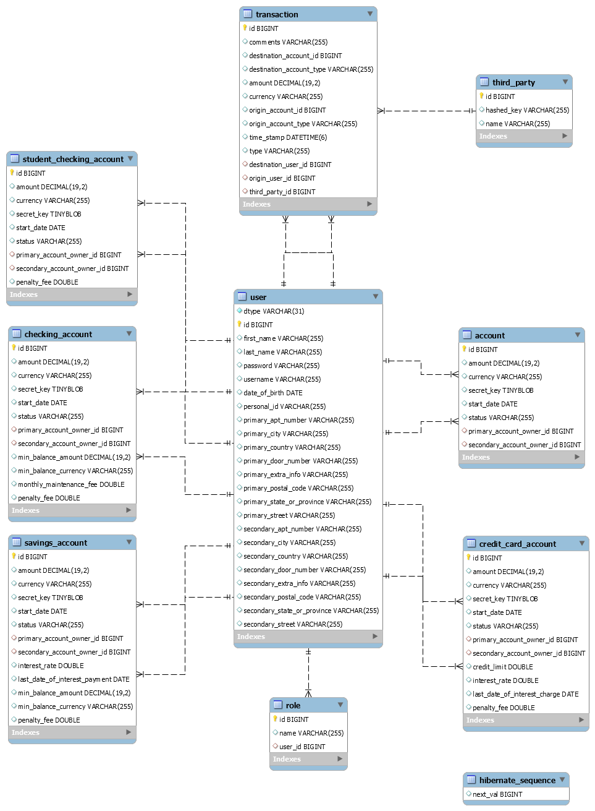

# BANKING SYSTEM API
### RESTFull API for a banking system developed using Java Spring-Boot

Ironhack's MidTerm project 2021

---

### Requirements and Instructions
[Here](src/main/resources/static/Ironhack instructions.pdf) you can find all the requirements for developing this project.

 

### Documentation
[Here](https://documenter.getpostman.com/view/10079423/TWDRu195) you can find the API documentation containing all the endpoints, explanations and examples for requests and responses.

 

### Database EER (Enhanced Entity-Relationship) Diagram
The following image shows the models and its relationships.

 

### Stack used
- Java SEE
- Spring-boot
- Maven
- Hibernate
- MySQL
- jUnit
- Basic Auth

 

### Toolkit
- IntelliJ IDEA
- MySQL Workbench
- Postman
- Remote MySQL
